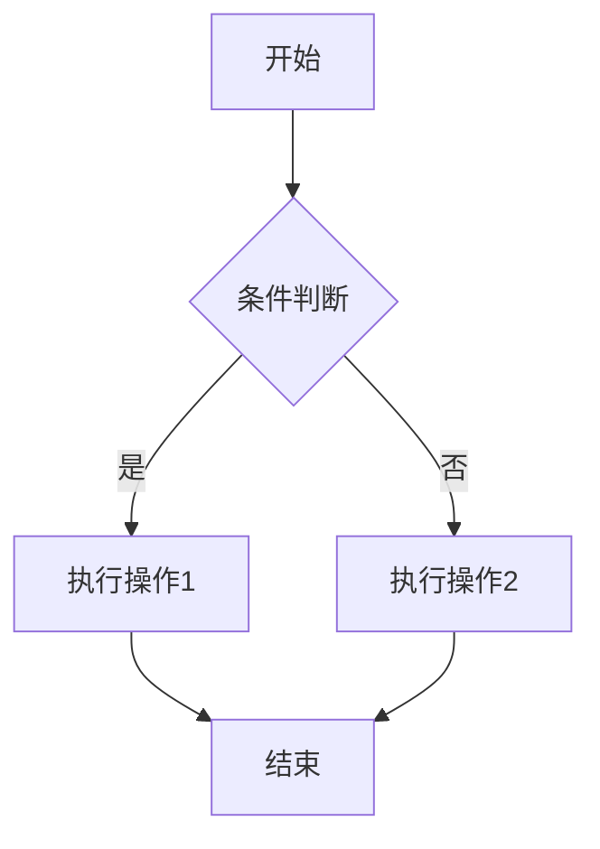

## 使用VScode插件
markdown all in one
markdown pdf
markdown preview enhanced
paste image
# Mark down语法记录
## 二级标题
......
###### 六级标题

# 引用
>这是一段引用

列表
# 有序列表
1. 打开冰箱
2. 关上冰箱
   
# 无序列表
- 打开冰箱
* 关上冰箱
  
# 任务列表
- [ ] 吃饭
- [x] 睡觉

#代码块
```py
print('hello world')
```

# 数学公式
$$
latex
$$

# 表格:
|姓名|年龄|成绩|
|:---|---:|:---:|
|黄佳文|25|100|
|张三|20|70|

 # 脚注
 需注释文本^[注释内容1]

 这里是1的注释^[注释内容2]

 # 横线
---
 横线后内容

 # 链接
 [百度](baidu.com"一个搜索")
 # 跳转链接
 请参考[表格](#表格)
 # 引用链接
 [百度](id)

[id]:baidu.com
 [百度](id)
  [百度](id)

   [百度](id)

    [百度](id)
     [百度](id)
URL:
http://www.baidu.com

# 图片


# 其它
*斜体*
**加粗**
***斜体且加粗***
行内代码`print('代码')`
<u>下划线文字</u>
:s
$\theta=x^2$
### 下标  上标
H~2~O
X^2^

# 高亮文字
==这一段高亮==

# 视频
<iframe src="//player.bilibili.com/player.html?isOutside=true&aid=327623069&bvid=BV1JA411h7Gw&cid=171385214&p=1" scrolling="no" border="0" frameborder="no" framespacing="0" allowfullscreen="true"></iframe>

# mermaid图



